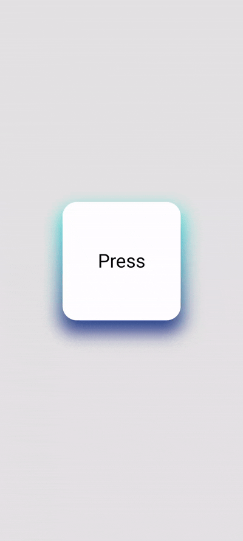

# 🌑 Shadow

A lightweight Jetpack Compose library providing customizable shadow effects — supporting both **solid colors** and **shaders (like gradients)**.

Easily apply smooth, dynamic shadows to your composables with simple `Modifier` or `DrawScope` extensions.

---

## Preview


## Installation

### Step 1: Add JitPack to your `settings.gradle`

```kotlin
dependencyResolutionManagement {
    repositories {
        google()
        mavenCentral()
        maven(url = "https://jitpack.io")
    }
}
```

### Step 2: Add the following to your `build.gradle`:

```kotlin
dependencies {
    implementation("com.github.vasyl-stetsiuk:shadow:'latest_version'")
}
```
[](https://jitpack.io/#vasyl-stetsiuk/shadow)

## Usage

### With color

```kotlin
val shape = RoundedCornerShape(24.dp)
Spacer(
    modifier = Modifier
        .shadow(
            fillStyle = ShadowFillStyle.WithColor(Color.Black.copy(0.1f)),
            blurRadius = 24.dp,
            shape = shape,
            spread = 4.dp,
            translationX = 0.dp,
            translationY = 16.dp
        )
        .size(200.dp)
        .background(Color.White, shape)
)
```

### With shader (vertical gradient in this case)

```kotlin
val shape = RoundedCornerShape(24.dp)
Spacer(
    modifier = Modifier
        .shadow(
            fillStyle = ShadowFillStyle.WithShader{
                LinearGradientShader(
                    from = Offset(size.width / 2, 0f),
                    to = Offset(size.width / 2, size.height),
                    colors = listOf(Color(0xFF2be4dc), Color(0xFF243484)),
                )
            },
            blurRadius = 24.dp,
            shape = shape,
            spread = 4.dp,
            translationX = 0.dp,
            translationY = 16.dp
        )
        .size(200.dp)
        .background(Color.White, shape)
)
```

### Inside DrawScope

```kotlin
val shape = RoundedCornerShape(24.dp)
Spacer(
    modifier = Modifier
        .drawBehind { 
            drawShadow(
                fillStyle = ShadowFillStyle.WithColor(Color.Black.copy(0.1f)),
                blurRadius = 24.dp.toPx(),
                shape = shape,
                spread = 4.dp.toPx(),
                translationX = 0.dp.toPx(),
                translationY = 16.dp.toPx()
            )
        }
        .size(200.dp)
        .background(Color.White, shape)
)
  ```      

## Credits

Made by @vasyl-stetsiuk


## 📃 License

Apache License 2.0. See [LICENSE](LICENSE) for full details.
